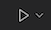

# Python Playground
This is an empty python project for you to use to play with the language.

## Step 1: Open a Terminal
At the top of the screen, find the **Terminal** menu, and select **New Terminal**. You should see the following in the lower pane (except in pretty colors). This is your *command prompt.*

```
vscode ➜ /workspaces/python-playground (main ✗) $
```

## Interactive Python
```
vscode ➜ /workspaces/python-playground (main ✗) $ python
```
At the command prompt, type `python` and press enter. This will launch Python in interactive mode. You now have a Python command prompt, which we'll call a Python *shell,* that looks like this:
```
Python 3.10.2 (main, Feb  8 2022, 04:44:29) [GCC 10.2.1 20210110] on linux
Type "help", "copyright", "credits" or "license" for more information.
>>>
```
You may enter Python expressions directly, and it will print out both the return value of the expressions and any print statements. 
```
>>> 5 + 6
11
>>> print('hi there')
hi there
>>>
```
To exit this Python shell, give it the expression `exit()` (yes it's a function), or hit **Ctrl-D**.
```
>>> exit()
vscode ➜ /workspaces/python-playground (main ✗) $
```

## Python Scripts
A Python program is often called a *script.* To make a new script, simply create a new file in VSCode (under the **File** menu). Save it immediately with whatever name you want, as long as that name ends in `.py`

I've created one already for you: `hello_world.py`

To run a script, click the run button in the upper-right corner of VSCode: 

You may also use the command line to run a script. Type `python` followed by the name of the file. It will run the script once and return to the Linux command prompt.

PRO TIP: you can use the **tab** key to let the command prompt auto-complete the typing of things once you've typed enough that it knows what you're talking about.

```
vscode ➜ /workspaces/python-playground (main ✗) $ python hello_world.py 
Hello, world!
```

## Letting VSCode Make Your Life Easier
Thanks to the Python plugin in VSCode (which is automatically installed with the container), you get
a little "play" button in the upper-right corner when a python file is being edited. Clicking that button will run the file in the terminal with a single click!

For more information: <https://code.visualstudio.com/docs/python/python-tutorial#_run-hello-world>